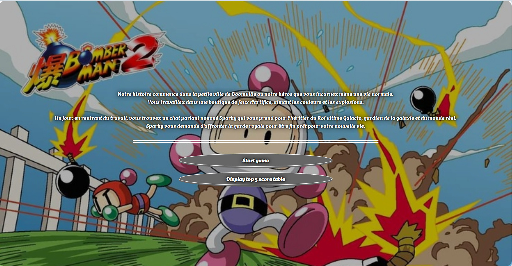
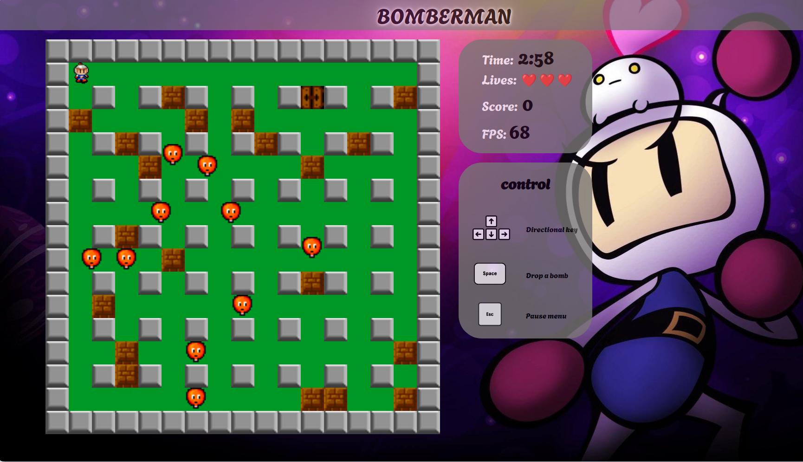
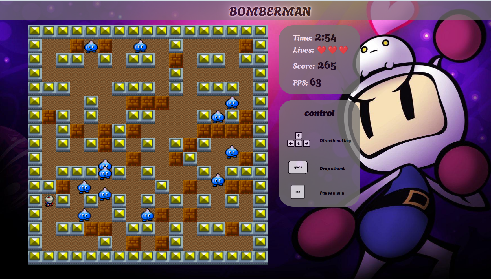
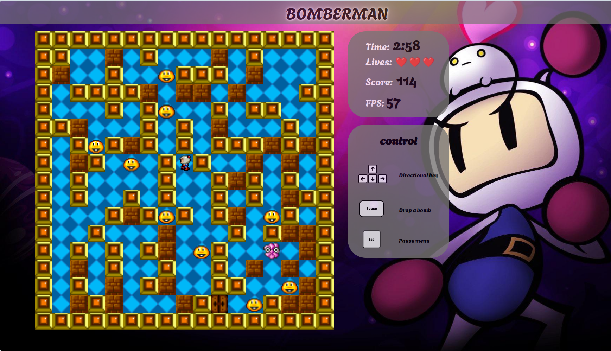
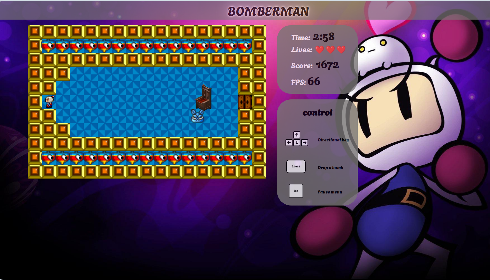

 # Make your Game

### Descriptif
_______
Nous avons recréé un Bomberman (jeu vidéo classique) solo qui met en scène un personnage posant des bombes pour éliminer les obstacles et les ennemis. Le jeu se déroule en plusieurs niveaux, chacun présentant un nouveau défi.

**- Objectif** : Le joueur incarne un personnage, dont le but est d'éliminer tous les ennemis présents sur la carte pour pouvoir passer au niveau suivant.<br>
**- Niveaux** : Chaque niveau est composé de blocs destructibles (pouvant être détruits par les bombes) et indestructibles. Chaque niveau devient progressivement plus difficile, introduisant de nouveaux obstacles, ennemis et/ou défis.<br>
**- Bombes** : Le joueur peut poser des bombes pour détruire les obstacles et éliminer les ennemis. Attention : Les ennemis et le joueur peuvent être éliminés en étant touchés par l'explosion d'une bombe.<br>
**- Ennemis** : Des ennemis se déplacent dans le labyrinthe et tentent d'éliminer le joueur en le touchant.<br>
**- Déplacements** : Le joueur peut se déplacer horizontalement et verticalement à travers le labyrinthe, mais ne peut pas passer à travers les blocs.<br>
**- Victoire** : Le joueur gagne en éliminant tous les ennemis (classique et boss).<br>
**- Défaite** : Si le joueur est touché par une explosion de sa propre bombe, il perd une vie. Le jeu se termine lorsque toutes les vies sont épuisées ou lorsqu'un ennemi le touche.

Bomberman combine action et stratégie, offrant une expérience de jeu divertissante et stimulante pour les joueurs de tout âge.

### Image
_______
<table align= "center" width="95%">
    <tbody>
        <tr>
            <td colspan="2"></td>
        </tr>
        <tr>
            <td></td>
            <td></td>
        </tr>
        <tr>
            <td></td>
            <td></td>
        </tr>    
    </tbody>
</table>

### Usage
_______
```go
go run . 
```

### Dependance
_______
Le front utilise du `javascript`, `html` et `css` pour faire tourner le jeu.<br>
Le back utilise un serveur en `go version 1.19` pour gérer les scores. Le serveur Go utilise la librairie [Gorilla](https://pkg.go.dev/github.com/gorilla/websocket) websocket

### Authors
_______
+ Diane VANIER
+ Joris BORGES
+ Fabien OLIVIER
